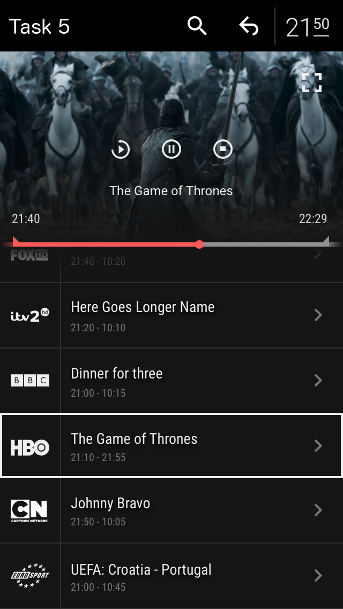

# Simple TV: Responsiveness

*Even though this task is based on the previous subtask, it has it's own assets and additional elements.*

Read http://doc.qt.io/qt-5/scalability.html thoroughly.

## Example Mockups

## Elements

1. Show channel list and video contained in [channels.xml](channels.xml).
2. By default, first channel is selected.
3. Render selected channel name in red color.
4. Channel can be selected by click or key up/down.
5. On select play channel URL in video and update information.
6. Show top bar on top of the screen as specified in the mockup.
7. Clock should update every minute.
8. Back button should leave application, while search button should open new empty screen.
9. In portrait mode show video on top of the channel list, in landscape show video on the right.
10. Add play from start, play/pause (while playing show pause, while paused/stopped show play) and stop icon (shown if video is not stopped) in the middle of the video and make them functional.
11. Add enter/exit fullscreen icon in the bottom right corner that makes video fill screen when full screen is active.
12. In fullscreen show video with information at the bottom, while channel list and top bar should be hidden.
13. Progress bar starts from `start` time and ends with `end` time as defined in the [channels.xml](channels.xml) file.
14. Current progress value is current time.
15. Icon controls, i.e. pause, play, stop enter/exit fullscreen, should be shown when clicked on video for 5 seconds, after that they should auto hide.
16. For icons use [Ionicons](https://github.com/driftyco/ionicons).
17. Run application on Android emulator in configurations for mobile and tablet devices.
